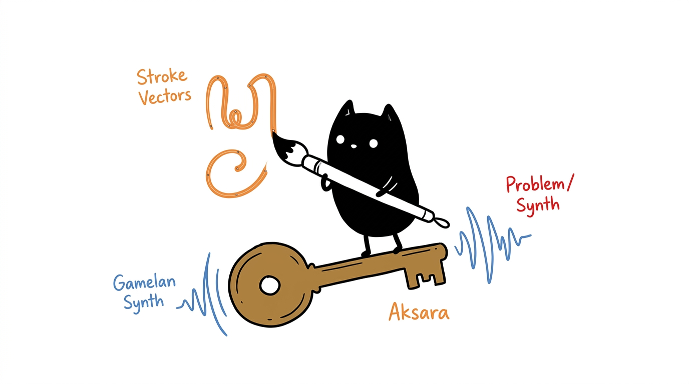

# Petualangan Ajisaka 👑



Petualangan Ajisaka adalah Progressive Web App (PWA) berbasis luring-pertama (*offline-first*) yang dibangun untuk mengajarkan Aksara Jawa. Aplikasi ini menyusun proses pembelajaran sebagai sebuah perjalanan melintasi tiga pulau, bergerak dari pengenalan huruf dasar hingga pasangan konsonan yang kompleks.

Alih-alih mengandalkan pertanyaan pilihan ganda sederhana atau pencocokan kanvas *pixel-perfect*, kami membangun mesin evaluasi guratan kustom dan penyintesis aditif untuk umpan balik audio. Aplikasi ini berjalan sepenuhnya di dalam peramban (*browser*) dan tidak memerlukan koneksi internet setelah pemuatan awal.

## Arsitektur & Mekanika

- **Pengenalan Guratan Geometri Vektor**: Kanvas menggambar menangkap masukan pengguna sebagai jalur koordinat, menormalisasikannya, dan mengevaluasinya terhadap kontur referensi menggunakan algoritma Jarak Chamfer (*Chamfer Distance*). Hal ini mencegah pemain berbuat curang dengan mencoret-coret seluruh kanvas dan memastikan evaluasi diskalakan dengan benar di berbagai resolusi layar.
- **Audio Gamelan Pemodelan Fisik**: Aplikasi ini menyintesis efek suaranya sendiri menggunakan Web Audio API bawaan. Saat pemain menyelesaikan sebuah guratan, hal ini memicu pukulan Gamelan yang dimodelkan lengkap dengan *exciter* pemukul, filter *low-pass* yang diredam secara dinamis, dan karakteristik *Ombak* (ketukan akustik) dari perunggu yang beresonansi. Audio juga dilengkapi dengan kontrol volume (*gain*) master dan *lookahead* penjadwalan dinamis untuk mencegah gangguan audio dari beban utas utama (*main-thread jitter*).
- **Pelacakan Status Granular**: Kemajuan permainan dilacak dan disimpan secara lokal melalui Zustand. Pemain dapat meninggalkan aplikasi di pertengahan level dan kembali tanpa kehilangan fase, pulau, atau item yang telah terbuka. Preferensi pengguna seperti bahasa, volume, dan mode bisu juga disimpan secara otomatis.
- **Pelokalan Tiga Bahasa**: Antarmuka, cerita, dan petunjuk menggambar sepenuhnya diterjemahkan ke dalam bahasa Indonesia, Inggris, dan Jawa Krama Inggil.
- **Mode Ketik Bebas**: Kotak pasir khusus di mana pengguna dapat menguji papan ketik virtual dan melihat karakter Aksara Jawa mereka ditransliterasikan ke dalam teks Latin secara *real-time*.

## Detail Teknis

Basis kode ini disusun menggunakan React 18 dan Vite.

- **Kerangka Frontend**: React 18 (TypeScript)
- **Gaya**: Tailwind CSS v4, dibangun di atas sistem token warna OKLCH untuk konsistensi tema.
- **Status (State)**: Zustand dengan persistensi `localStorage`.
- **Perutean (Routing)**: React Router menggunakan HashRouter untuk memastikan navigasi luring yang stabil tanpa aturan penulisan ulang sisi peladen (*server-side*).
- **Kemampuan Luring**: Workbox melakukan pra-tembolok (*precache*) pada bundel HTML, font Aksara Jawa kustom (WOFF2), dan aset minimal.

## Menjalankan Aplikasi

Anda membutuhkan Node.js (v18 atau lebih baru) untuk menjalankan server pengembangan.

1. Klon repositori:
   ```bash
   git clone https://github.com/1999AZZAR/ajisaka.git
   cd ajisaka
   ```
2. Instal dependensi:
   ```bash
   npm install
   ```
3. Mulai server pengembangan Vite:
   ```bash
   npm run dev
   ```

Untuk menguji interaksi sentuh pada perangkat seluler di jaringan lokal Anda, jalankan server dengan `npm run dev -- --host` dan buka alamat IP lokal yang disediakan di ponsel Anda.

### Menggunakan Docker

Jika Anda lebih suka menggunakan Docker, Anda dapat membangun dan menjalankan citra produksi menggunakan Dockerfile multi-tahap yang disertakan:

1. Bangun citra (*image*):
   ```bash
   docker build -t ajisaka .
   ```
2. Jalankan kontainer:
   ```bash
   docker run -p 8080:80 ajisaka
   ```
Aplikasi akan tersedia di `http://localhost:8080`.

## Dokumentasi

Untuk memahami proyek ini lebih dalam, Anda dapat membaca dokumen-dokumen berikut yang berada di dalam folder `docs/`:

- [**Desain & Pengembangan**](docs/DESIGN_AND_DEV.md) - Panduan komprehensif mengenai arsitektur, UI/UX, dan keputusan teknis.
- [**Naskah Cerita & Lore**](docs/NASKAH_AJISAKA.md) - Naskah cerita petualangan, dialog karakter, dan latar belakang dunia.
- [**Garis Waktu Proyek**](docs/TIMELINE.md) - Catatan perjalanan dan log harian selama proses pengembangan proyek.
- [**Daftar Tugas (TODO)**](docs/TODO.md) - Daftar perbaikan bug, penyempurnaan UI, dan fitur masa depan.

## Tata Letak Repositori

- `src/engine/` - Logika matematis untuk geometri guratan kanvas (`raster.ts`, `geometry.ts`) dan penyintesis audio pemodelan fisik (`audio.ts`).
- `src/state/` - Penyimpanan Zustand untuk melacak kemajuan dan konfigurasi pengguna.
- `src/ui/` - Tampilan React, komponen UI, dan papan ketik virtual.
- `src/data/` - Konfigurasi statis untuk ketiga level dan definisi JSON untuk kontur SVG Aksara Jawa.
- `docs/` - Dokumen perencanaan, skrip, dan pelacakan tugas.

## Lisensi

Proyek ini dilisensikan di bawah [Lisensi MIT](LICENSE).
