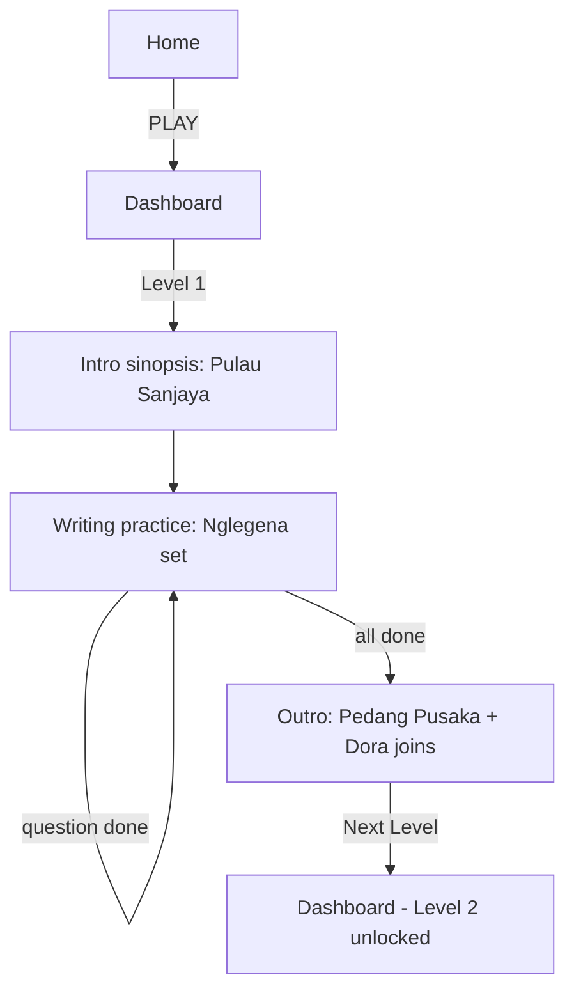
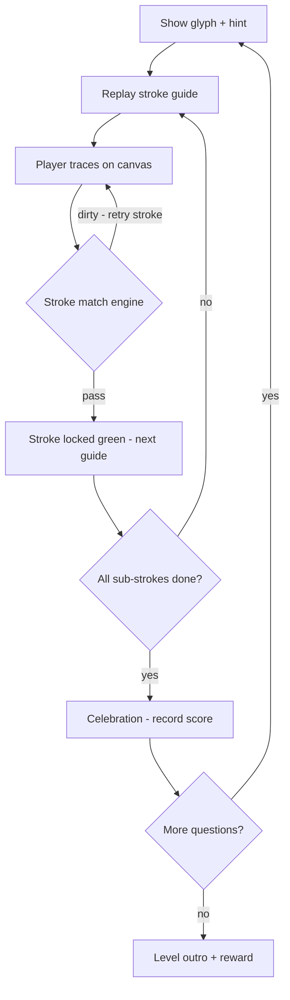

# Petualangan Ajisaka — Aplikasi Pembelajaran Menulis Aksara Jawa

**Design & Development Document**

| | |
|---|---|
| **Version** | 0.1 (draft) |
| **Date** | 2026-08-12 |
| **Status** | Design document — pre-build |
| **Delivery target** | Installable Progressive Web App (PWA) |
| **Source material** | `projek Isif.pdf` — *Naskah Lengkap Aplikasi Petualangan Ajisaka* |

---

## 1. Overview

**Petualangan Ajisaka** is a gamified learning application that teaches children to
read and write **Aksara Jawa** (the Javanese script) through a story-driven
adventure. The player follows the legendary hero **Ajisaka** across three islands,
unlocking relics and defeating enemies by completing on-screen handwriting
practice challenges.

The app runs entirely inside the browser and is packaged as an installable,
**offline-capable PWA** so students on low-end tablets and school Chromebooks can
play without connectivity.

### 1.1 What the product is

- A *stroke-practice* game: the player literally writes Aksara Jawa with a finger
  or stylus on a canvas, guided by animated arrow guides (stroke order + direction).
- A *narrative adventure*: writing missions are framed as story events (unlock a
  sword seal, answer a village elder's test, battle a giant's envoys).
- A *progression system*: three levels (Pemula → Mahir → Master), rewards
  (Pedang Pusaka, Perisai Sakti), followers joining the party (Dora, the local
  villager), and a final exam + crowned-ending.

---

## 2. Goals & Non-Goals

### 2.1 Goals

| # | Goal |
|---|------|
| G1 | Teach correct **stroke order and direction** for Aksara Jawa basics (Nglegena), Sandangan, and Pasangan. |
| G2 | Keep learners motivated through narrative, rewards, and escalating difficulty. |
| G3 | Work **offline** and be **installable** on Android tablets, iPads, and desktop browsers (PWA). |
| G4 | Give immediate, friendly feedback on each stroke (truthy/dirty, live). |
| G5 | Track progress locally per device (no account required for MVP). |
| G6 | Provide a complete, reusable dataset of Aksara Jawa strokes and Unicode mappings for future features (transliteration, quizzes). |

### 2.2 Non-goals (MVP)

- ✗ Server accounts, cloud sync, or leaderboards (future work).
- ✗ Freehand recognition beyond the taught question set (no arbitrary text input).
- ✗ Audio instructions / speech synthesis (future; on-screen text only).
- ✗ Multi-language UI beyond Indonesian + minimal English (future).
- ✗ Native app stores (PWA only for now; TWA/APK wrapper considered later).

---

## 3. Target Users & Personas

| Persona | Profile | Needs |
|---|---|---|
| **Adi (9 y.o.)** | Primary: elementary student learning Aksara Jawa in class | Playful, guided practice, immediate feedback, feels like a game |
| **Bu Sari (32 y.o.)** | Teacher | Assignable practice, clear level map, zero-install on classroom tablets |
| **Pak Damar (40 y.o.)** | Parent helping at home | Simple install, offline, no account, safe kid UI |

**Design consequence:** big touch targets (≥ 48px), high-contrast solid buttons,
readable Indonesian copy, minimal typing, zero ads, zero tracking.

---

## 4. Narrative & Content Spec (from source PDF)

### 4.1 High-level arc

```
Petualangan Ajisaka
  ├─ Prolog ─ Mengenal Asal-usul Aksara Jawa (edukasi)
  ├─ Level 1 ─ Pemula   · Pulau Sanjaya    → Pedang Pusaka    (+ Dora joins)
  ├─ Level 2 ─ Mahir    · Pulau Adi Jaya   → Perisai Sakti    (+ warga lokal joins)
  └─ Level 3 ─ Master   · Kerajaan Nusantara (2 fase) → Raksasa Hijau defeated → crowned King
```

### 4.2 Screen / menu breakdown

| # | Screen | Content | Writing mechanic |
|---|--------|---------|------------------|
| 0 | **Halaman Awal (Splash/Home)** | Media title + big **PLAY** button | — |
| 1 | **Dashboard (Main Menu)** | 5 navigation menus: Prolog, Level 1, Level 2, Level 3, *Kembali ke Rumah* | — |
| 2 | **Prolog** | Educational page: history & origin of Aksara Jawa | — |
| 3 | **Level 1 — Pemula** (Pulau Sanjaya) | Sinopsis: unlock seal + take the sword. **Narasi sinopsis tidak diekstrak utuh dari PDF** → open question §20 | Write **Aksara Dasar (Nglegena)** with **arrow stroke-guides** |
| 4 | **Level 1 End** | Reward: **Pedang Pusaka**; meeting **Dora** joins the party | — |
| 5 | **Level 2 — Mahir** (Pulau Adi Jaya) | Sinopsis: sail with Dora, find **Perisai Sakti**, a local villager sets a test | **11 soal** (per narrative) of Sandangan writing |
| 6 | **Level 2 End** | Reward: **Perisai Sakti**; villager joins party; *Next Level* | — |
| 7 | **Level 3 — Master, Fase 1** (Penghadangan Dua Utusan) | Two Green Giant envoys intercept the ship at sea; defeat them by writing | **20 soal Aksara Pasangan** (stacked consonants: main letter + attached pasangan below/side), full stroke-guide |
| 8 | **Level 3 — Master, Fase 2** (Penyegelan Raksasa Hijau) | Infiltrate Nusantara Kingdom; free it from the Green Giant | **3 latihan menus × 5 soal = 15 soal**: (1) kalimat dgn Aksara Dasar, (2) kalimat dgn Sandangan, (3) kalimat dgn Pasangan |
| 9 | **Akhir Cerita** | Happy ending: Green Giant sealed away; player crowned **Raja Kerajaan Nusantara** | — |

### 4.3 Numbers locked from the narrative

| Item | Count | Source |
|---|---|---|
| Level 2 writing questions | **11** | "ke-11 soal" |
| Level 3 Fase 1 questions | **20** (pasangan) | narrative |
| Level 3 Fase 2 questions | **15** (3 × 5) | narrative |
| Level 1 question count | *unspecified* | **open question §20** |

### 4.4 Content gaps to confirm (from PDF anomalies)

1. Level 1 synopsis text for Pulau Sanjaya (the "unlock the seal" beat is present,
   but the full story paragraph was empty in extraction).
2. Whether Level 1 *requires* Nglegena only, or includes a tutorial sub-mode.
3. Reward naming convention + visual style (game-asset source or in-app SVG?).

---

## 5. Functional Requirements

### FR-1 · Home & Navigation
- **FR-1.1** Home screen shows the media title and a primary **PLAY** button.
- **FR-1.2** PLAY opens the dashboard; system back or "Kembali ke Rumah" returns home.
- **FR-1.3** Dashboard always lists `Prolog`, `Level 1`, `Level 2`, `Level 3`, `Kembali ke Rumah`.
- **FR-1.4** Locked levels are visually locked and show a "complete previous level" hint (do not hard-block navigation; allow reading Prolog anytime).

### FR-2 · Story / Prolog
- **FR-2.1** Prolog renders the origin story of Aksara Jawa as illustrated scenes.
- **FR-2.2** Supports tap-to-advance (like a slide deck); skippable with confirmation.

### FR-3 · Writing Practice (core gameplay)
- **FR-3.1** Each question shows a reference glyph (rendered with the Javanese font) + its romanization + Indonesian hint.
- **FR-3.2** A canvas area captures freehand strokes (single touch/stylus; multi-touch disabled).
- **FR-3.3** Animated **stroke guide**: numbered arrow heads showing direction and order, replayable on demand.
- **FR-3.4** Live feedback: stroke match indicator (e.g., green = good, amber = acceptable, red = wrong direction/order).
- **FR-3.5** Between strokes, guide for the next sub-stroke highlights; completed strokes stay visible.
- **FR-3.6** **Undo / Clear** controls (big, kid-safe).
- **FR-3.7** After a question completes: celebratory micro-feedback, then auto-advance or "Lanjut".
- **FR-3.8** A wrong-but-attempted answer can be retried (no fail-state lock on MVP).

### FR-4 · Level Flow & Rewards
- **FR-4.1** Level intro screen = story beat (sinopsis) → practice session → outro beat.
- **FR-4.2** On completion show reward item + story update (e.g., "Dora bergabung!").
- **FR-4.3** "Next Level" button unlocks the following level.
- **FR-4.4** Level 3 has two phases with a phase-transition interstitial.

### FR-5 · Persistence
- **FR-5.1** Persist: completed levels, per-question best score, collected rewards, settings.
- **FR-5.2** Resumable: closing mid-level returns to dashboard with progress intact; continue begins from first unanswered question.
- **FR-5.3** Storage: local-first (IndexedDB via `localStorage` facade for MVP state; canvas data ephemeral).

### FR-6 · PWA
- **FR-6.1** Installable (valid manifest + icons + service worker).
- **FR-6.2** Official **offline-first**: full app shell + asset (fonts, data, icons) precache; no network needed to play.
- **FR-6.3** Updates: versioned SW with prompt-to-refresh when a new release is cached.

---

## 6. Information Architecture & Navigation

```
Home (Halaman Awal)
  │  [PLAY]
  ▼
Dashboard ────────────────► (5 menu)
  ├── Prolog ─────────────► Story slides ──► back
  ├── Level 1 (Pemula) ───► [Intro sinopsis] ─► Practice L1 ─► [Reward: Pedang] ─► Next Level
  ├── Level 2 (Mahir) ────► [Intro sinopsis] ─► Practice L2 (11) ─► [Reward: Perisai] ─► Next Level
  ├── Level 3 (Master) ───► Fase 1: Practice Pasangan (20) ─► Fase 2: Lat.1 (5) Lat.2 (5) Lat.3 (5) ─► Ending
  └── Kembali ke Rumah ───► Home
```

### 6.1 Navigational rules
- Global, persistent **back** affordance on every non-dashboard screen (system back + visible button).
- Dashboard is the central hub; all level screens return to it.
- *Next Level* is the only forward gate; it appears only after a level completes.

---

## 7. User Flows

### 7.1 First play through Level 1


### 7.2 Single-question writing loop


---

## 8. Screen Inventory (route map)

| Route | Screen | Key UI |
|---|---|---|
| `/` | Home | Title, PLAY |
| `/menu` | Dashboard | 5 level cards |
| `/prolog` | Prolog story | Slides, skip |
| `/level/1` | L1 flow | Intro / practice / outro |
| `/level/2` | L2 flow | Intro / practice(11) / outro |
| `/level/3` | L3 flow | Fase1 practice(20) → Fase2 3×latihan(15) → ending |
| `/ending` | Happy ending | Crown ceremony |

(Routes are client-side only; PWA serves the app shell for every path → use hash router or SW navigation fallback to `/`.)

---

## 9. Design System

### 9.1 Design language
Three layers (per product guardrails):

1. **Material You** — interaction model: adaptive touch surfaces, tonal surfaces,
   dynamic elevation, large padded buttons, rounded corners.
2. **Minimalism** — layout discipline: generous whitespace, clear hierarchy,
   one primary action per screen, reduced visual noise so a 9-year-old isn't overwhelmed.
3. **Glassmorphism** — only as an *accent* on story/interstitial screens (frosted
   panels over illustrated backgrounds); not on gameplay surfaces (sketch canvases
   must stay glare-free for writing).

Genre: **playful** (post-Linear soft school: consumer, casual, children). Warm,
pastel-dominant palette with deep "keraton" accents. Illustrations are the brand:
hand-drawn Ajisaka line-art silhouettes (simple SVG), not photos.

### 9.2 Palette (Keraton theme)

Derived from the playful **Carnival** token system, re-hued toward Javanese
heritage colors (keraton indigo/red-gold + batik neutrals), pastel-first.

| Token | Value (OKLCH) | Use |
|---|---|---|
| `--color-paper` | `oklch(97% 0.012 78)` | App background (batik cream) |
| `--color-paper-2` | `oklch(92% 0.03 78)` | Card surfaces |
| `--color-paper-3` | `oklch(84% 0.05 55)` | Hover/interactive surface |
| `--color-text` | `oklch(34% 0.04 262)` | Primary text (deep indigo-black) |
| `--color-text-2` | `oklch(52% 0.03 262)` | Muted text |
| `--color-accent` | `oklch(58% 0.14 25)` | Primary action (keraton red / terracotta) |
| `--color-accent-2` | `oklch(70% 0.13 80)` | Success / gold (pedang & perisai rewards) |
| `--color-warn` | `oklch(66% 0.14 60)` | Warning / retry stroke |
| `--color-error` | `oklch(52% 0.16 27)` | Error / wrong stroke |
| `--color-border` | `oklch(86% 0.025 78)` | Dividers |
| `--color-focus` | `oklch(60% 0.16 262)` | `:focus-visible` ring (indigo) |
| `--color-glass` | `oklch(100% 0 0 / 0.55)` | Frosted overlay fill |

Dark mode: derived automatically by inverting paper band (keep for classroom)
via `@media (prefers-color-scheme: dark)` + `[data-theme=dark]`.

### 9.3 Typography

| Role | Token | Stack |
|---|---|---|
| Display / game titles | `--font-display` | `'Fredoka One', 'Baloo 2', system-ui, sans-serif` (rounded, kid-friendly) |
| Body / copy | `--font-body` | `'Nunito', system-ui, sans-serif` |
| Code / glyph data labels | `--font-mono` | `'JetBrains Mono', monospace` |

**Scale** (from token system): display `clamp(2.5rem,6vw,4.5rem)`, display-s
`clamp(2rem,4vw,3rem)`, 2xl `1.75rem`, xl `1.25rem`, lg `1.125rem`, base `1rem`,
sm `0.875rem`, xs `0.75rem`.

**Rules:** headings always roman (no italic headings); italics only inside body
copy for emphasis. Indonesian copy throughout; keep sentences short (≤ 12 words).

**Javanese glyph font:** self-hosted **Noto Sans Javanese** (Unicode block
U+A980–U+A9DF) for rendering reference glyphs. Fallback font-stack on canvas:
`'Noto Sans Javanese', sans-serif`. (Earliest glyph loads are precached by the SW.)

**Regional Stylistic Differences (Gagrak Surakarta vs Yogyakarta):**
The application strictly uses pure **Noto Sans Javanese**, which is based on the **Gagrak Surakarta** style convention. Clients and users may notice that certain characters—specifically **ra (ꦫ)**, **da (ꦢ)**, and **dha (ꦝ)**—have slightly different shapes compared to standard school textbooks, which often use the **Gagrak Yogyakarta** style.

- **Why this happens (The Technical Constraint):** Javanese is a highly complex script. When a user types a base letter and adds a vowel mark (like *suku* or *wulu*), the font doesn't just place them next to each other. Instead, the font engine uses complex built-in rules (called GSUB or Glyph Substitution) to magically swap both pieces into a brand-new, beautifully drawn combined shape (a ligature). 
- **The Design Decision:** If we tried to surgically swap just the base `ra`, `da`, or `dha` shapes to look like the textbook versions, those complex combination rules would instantly break. When a user tried to type, the letters would either disconnect, overlap incorrectly, or unexpectedly revert to the old shapes. 
- **Business Rationale:** Rebuilding a custom Javanese font with thousands of new GSUB ligature rules for the Yogyakarta style is a massive, highly specialized typographic engineering effort that is out of scope for this project. Therefore, we deliberately chose to use the robust, industry-standard Noto Sans font. This guarantees that typing, rendering, and gameplay are 100% bug-free and functional, with the accepted trade-off of using the Surakarta regional style.

### 9.4 Spacing, radius, elevation

- Spacing: 4px base scale (xs 4, sm 8, md 12, lg 16, xl 24, 2xl 32, 3xl 48 …).
- Radius: sm 4 / md 8 / lg 16 — reuse, never invent.
- Elevation: Material tonal elevation — cards = paper-2 on paper; modals use
  `box-shadow` with glass blur (story interstitials only).
- Touch targets: **min 48×48px**, interactive gap ≥ 8px.

### 9.5 Motion

- Durations: fast 150ms (hover/micro), base 250ms, slow 400ms (screen transitions).
- Easings: `cubic-bezier(0.16,1,0.3,1)` enter / `cubic-bezier(0.4,0,0.68,0.06)` exit.
- All entrance/stagger/counter/loader animation through **anime.js v4** snippets,
  each guarded by `prefers-reduced-motion`.
- Story slides: crossfade + slight scale; gameplay feedback: quick spring on stroke-lock.
- **Game feel:** confetti-ish particle burst on question completion and at level
  rewards (Web Canvas, keep under 60 particles).

### 9.6 Iconography

Font Awesome (free) per defaults; considered alternatives: Material Symbols,
Lucide. Use spellings/visuals a child recognizes (shield, sword, home, arrow,
question, star). All icon buttons carry `aria-label`.

### 9.7 Components (8-state discipline)

| Component | States to style |
|---|---|
| `Button` (primary/ghost/danger) | default, hover, focus-visible, active, disabled, loading, error, success |
| `LevelCard` | default, hover, focus, active, locked, completed, current, disabled |
| `PracticeCanvas` | idle, guiding, drawing, stroke-locked, feedback(ok/warn/error), cleared |
| `IconButton` (back/undo/clear/replay) | all 8 states |
| `Modal` (congrats, reset, update) | open/close anim + focus trap |

---

## 10. Domain Model & Data

### 10.1 Aksara dataset (`src/data/aksara.ts`)

```ts
type AksaraType = 'nglegena' | 'sandangan' | 'pasangan';

interface AksaraGlyph {
  id: string;                    // "ha", "na", "ca" ...
  type: AksaraType;
  label: string;                 // romanization
  hintID: string;                // Indonesian hint translation key
  unicode: string;               // e.g. "\uA98F" (ha)
  unicodePasangan?: string;      // pasangan glyph codepoint where applicable
  /** Normalized vector strokes, in units of the write-box (0..1). */
  strokes: Stroke[];             // ordered! = stroke-order/isomorphism
  sound?: string;                // phoneme for future TTS
}

interface Stroke {
  points: Array<{ x: number; y: number }>;  // polyline, 0..1 box coords
  tolerance: number;                         // per-stroke looseness (default 0.12)
}
```

### 10.2 Level config

```ts
interface LevelConfig {
  id: number;
  title: string;          // "Level 1 · Pemula · Pulau Sanjaya"
  questions: Question[];
  reward: { id: string; name: string };   // "Pedang Pusaka"
  story: { intro: string; outro: string };
}

interface Question {
  id: string;
  glyphId: string;        // → AksaraGlyph
  prompt: string;         // "Tulis aksara: HA (dasar)"
  sentence?: string;      // full Javanese sentence for Fase-2 questions
}
```

### 10.3 Seed content (proposed; volumes = open questions)

| Set | Type | Count |
|---|---|---|
| Nglegena (dasar) | 20 + optional variants | used in L1, L3-Fase2 menu 1 |
| Sandangan | 8 core (a→i,u,e,o, taling/tarung, pepet, cecak, etc.) | L2 (11 soal incl. combos), L3-F2 menu 2 |
| Pasangan | pair of main + pasangan glyph | L3-F1 (20 soal), L3-F2 menu 3 |

Final counts per level confirmed in §4.3; question contents (which glyphs) are a
**curriculum decision** — propose defaults §20.

---

## 11. Stroke Engine Design (core challenge)

### 11.1 Capture
- `<canvas>` full viewport of the write-box; **Pointer Events** (`pointerdown/move/up`)
  unified for touch + stylus + mouse; `touch-action: none` to stop scrolling.
- Points downsampled (≥ 10px spacing) and normalized into the 0..1 write-box.
- HiDPI: canvas sized to `devicePixelRatio`, CSS box fixed.

### 11.2 Stroke-guide rendering
- Draw each reference `Stroke` polyline as faint target guide.
- Animated progress along the path = the classic "arrow head" tracer (anime.js or
  requestAnimationFrame), replayable via **Replay** button.
- Next expected sub-stroke highlighted; completed strokes rendered solid + check.

### 11.3 Online matching (offline, deterministic, fast)
Approach to keep 0 weight and run on-device:
1. **Normalize** the input stroke (resample to N=32 points, scale to 0..1, translate
   to center, keep proportional aspect).
2. **Direction signature:** per-segment angle buckets (e.g., 8 bins).
3. **Raster Coverage** (Geometric Outline Matcher) distance to the reference normalized stroke (proxy: resampled dense polylines calculating intersection over expected perimeter area).
4. **Order = truth:** strokes must be completed in the reference order; a reversal
   triggers the "wrong direction" feedback even if the shape matches.
5. Score → `pass / warn / retry` via per-stroke tolerance.

Optional future upgrade: a tiny **ONNX/TFLite** model (`12 class output`,
< 500 KB) trained on augmentations of the 32 reference glyphs, run via
`@xenova/transformers` or plain TensorFlow.js — swapped behind the same
`StrokeMatcher` interface. **Not in MVP.**

### 11.4 Feedback mapping
| Signal | Meaning | Color |
|---|---|---|
| pass | stroke matched shape+order | green (`accent-2`) |
| warn | shape ok, slight drift | gold (`warn`) |
| retry | wrong direction / order | red (`error`) |

---

## 12. PWA & Architecture

### 12.1 Recommended stack

| Concern | Choice |
|---|---|
| Language | **TypeScript (strict)** |
| Build | **Vite** |
| UI framework | **React 18** (or Svelte if a lighter runtime is preferred — see §20) |
| Styling | **Tailwind CSS v4** with CSS custom-property tokens (OKLCH) |
| State | Zustand with `persist` middleware (localStorage) |
| Routing | `react-router` + **hash routing** (offline-friendly, no server rewrites needed) |
| PWA | `vite-plugin-pwa` (Workbox): manifest + SW precache + offline fallback |
| Canvas/game | Native Canvas 2D + anime.js v4 (motion) |
| Icons | Font Awesome (free) |
| Data-local | JSON/TS dataset (§10) + `localStorage` for progress |
| Tests | Vitest + Testing Library; Playwright (E2E, offline simulate) |
| Lint/format | ESLint (flat) + Prettier (matches existing `.pre-commit-config.yaml`) |
| Icons/app assets | inline SVG (kirik) so SW precache stays small |

### 12.2 Layered architecture

```
┌───────────────────────────────────────────────┐
│ UI Layer        React components, routes,      │
│                 screens, story slides          │
├───────────────────────────────────────────────┤
│ Application     LevelFSM, Question session,    │
│                 progress store, reward logic   │
├───────────────────────────────────────────────┤
│ Domain          aksara.ts dataset, Stroke      │
│                 matcher interface, scoring     │
├───────────────────────────────────────────────┤
│ Infrastructure  CanvasEngine (capture+guide), │
│                 Raster Coverage, Zustand persist,│
│                 PWA/SW, audio (gamelan blips)  │
└───────────────────────────────────────────────┘
```

### 12.3 State model (Zustand `useProgress`)

```ts
interface ProgressState {
  completedLevels: number[];        // [1,2,3]
  rewards: string[];                // ['pedang','perisai']
  bestByQuestion: Record<string, number>; // questionId -> percent score
  currentLevel?: number;            // resume point
  unfinished: string[];             // unresolved question ids in current level
  settings: { sound: boolean; dark: boolean };
}
```

### 12.4 Offline & SW strategy

- **Precache (build-time, hashed):** HTML shell, JS/CSS chunks, Javanese font
  (woff2), dataset, inline SVG icons — the entire app works with network off.
- **Runtime cache:** none required for MVP (all local); precache covers everything.
- **Update flow:** `registerSW` + prompt-to-refresh banner when `updatedready`.
- **No backend:** zero API calls; CSP tightened; no analytics.
- Manifest: name "Petualangan Ajisaka", `display: standalone`,
  `orientation: portrait` (writing optimised), theme color = `--color-paper`,
  icon set incl. `512px` maskable.

---

## 13. Proposed Project Structure

```
javanese_learning_app/
├─ public/
│  ├─ icons/            (192, 512, maskable)
│  └─ fonts/            (NotoSansJavanese woff2)
├─ src/
│  ├─ data/             aksara.ts, levels.ts, sentences.ts
│  ├─ engine/           capture.ts, normalize.ts, dtw.ts, matcher.ts
│  ├─ state/            progress.ts
│  ├─ ui/               components/, screens/
│  ├─ hooks/            useCanvas.ts, useStrokeSession.ts
│  ├─ styles/           tokens.css, base.css
│  ├─ App.tsx
│  └─ main.tsx
├─ vite.config.ts        (+ vite-plugin-pwa)
├─ tsconfig.json
├─ index.html
└─ DESIGN_AND_DEV.md
```

---

## 14. Testing Strategy

- **Unit:** `dtw.ts` (match/fail cases), `normalize.ts`, progress-store transitions,
  question scoring, level-unlock gating.
- **Component:** practice screen states (empty/guiding/warn/error/success), canvas
  button labels, modal focus trap.
- **E2E (Playwright):** flow Home→L1 completed→L2 unlocked; reload mid-level resumes;
  **offline emulation** verifies full playthrough with no network.
- **Manual device matrix:** iPad, Android tablet (Chrome), desktop (portrait mobile view).
- **A11y:** axe-core scan in CI.
- Pre-commit (existing hooks) keep running; add `eslint`/`prettier`/`tsc --noEmit` there.

---

## 15. Performance Budget (offline-first)

| Metric | Budget |
|---|---|
| First load (offline cache hit) | ≤ 1.5 MB JS + assets; font ≤ 600 KB woff2 |
| TTI on mid-range tablet | ≤ 3 s |
| SW precache total | ≤ 4–5 MB |
| Canvas frame during tracing | 60 fps |
| Recognition latency | < 50 ms (Raster Coverage on 0.02 step resample) |

---

## 16. Accessibility (WCAG 2.1 AA)

- Color is never the only signal: pass/warn/error carry icons + text.
- Focus-visible ring `--color-focus`, `outline-offset: 2px`; skip-link; landmark tags.
- Keyboard operable (arrows on story slides; Enter/Space on controls); canvas has
  an accessible fallback description for each question.
- `prefers-reduced-motion` disables stroke-guide animation, particles, slide fx.
- Contrast: body text ≥ 4.5:1; UI ≥ 3:1 (verify with WebAIM checker on final hex).
- All Indonesian copy short, plain; alt text on illustrated scenes.

---

## 17. Security

- No user input is rendered as HTML (all content from bundled dataset).
- CSP: `default-src 'self'; script-src 'self'; font-src 'self'; img-src 'self' data:;`
  (no external CDNs at runtime — everything precached).
- No secrets/keys in client (none needed); no network traffic to leak.
- Canvas input validated/ignored outside the write-box; multi-touch suppresses stray strokes.

---

## 18. Roadmap / Milestones

| Milestone | Scope |
|---|---|
| **M0 — Seed & shell** | Vite+TS app, tokens, routes, dashboard, manifest/SW, empty practice screen |
| **M1 — Stroke engine** | Canvas capture, guide animation, Raster Coverage matcher, feedback mapping |
| **M2 — Content** | Full dataset (Nglegena 20+ / Sandangan 8+ / Pasangan pairs), level configs, story copy in Indonesian |
| **M3 — Game flow** | Level FSM, rewards, Dora/villager joins, ending, progress persistence |
| **M4 — Polish QA** | Particles, sound, offline E2E, a11y scan, device matrix, update banner |

---

## 19. Future Work (after MVP)

- Transliteration / text-to-Aksara input; pronunciation (gamelan + TTS).
- Cloud sync & teacher analytics (rename: "Guru" report).
- Android APK via TWA; wider glyph set (Angka, Murda, Swara).
- ML stroke classifier upgrade behind the matcher interface.

---

## 20. Open Questions & Assumptions

| # | Question | Proposed default / status |
|---|---|---|
| 1 | Level 1 question count | Propose **10–12** Nglegena; confirm with curriculum. |
| 2 | Exact question contents per set | Propose starter sets; finalize with teacher input. |
| 3 | Full Level-1 sinopsis paragraph | Missing from PDF extraction — supply copy. |
| 4 | Reward/asset art source | Inline SVG illustrations; replaceable later. |
| 5 | UI framework | Recommend **React**; Svelte alternative if bundle size is critical. |
| 6 | Portrait-only PWA OK? | Yes (writing orientation); desktop shows rotated mock. |

---

## 21. References

- Source narrative: `projek Isif.pdf` (Naskah Lengkap Aplikasi Petualangan Ajisaka).
- Font: Noto Sans Javanese (OFL) — self-hosted.
- Standards: WCAG 2.1 AA; PWA installability criteria (Chrome/Android, iOS 16+).
- Design system basis: playful *Carnival* token set (paper/accent OKLCH architecture)
  re-hued to the keraton palette in §9.2.

---

*End of document. Next step: confirm §20 decisions, then scaffold M0.*