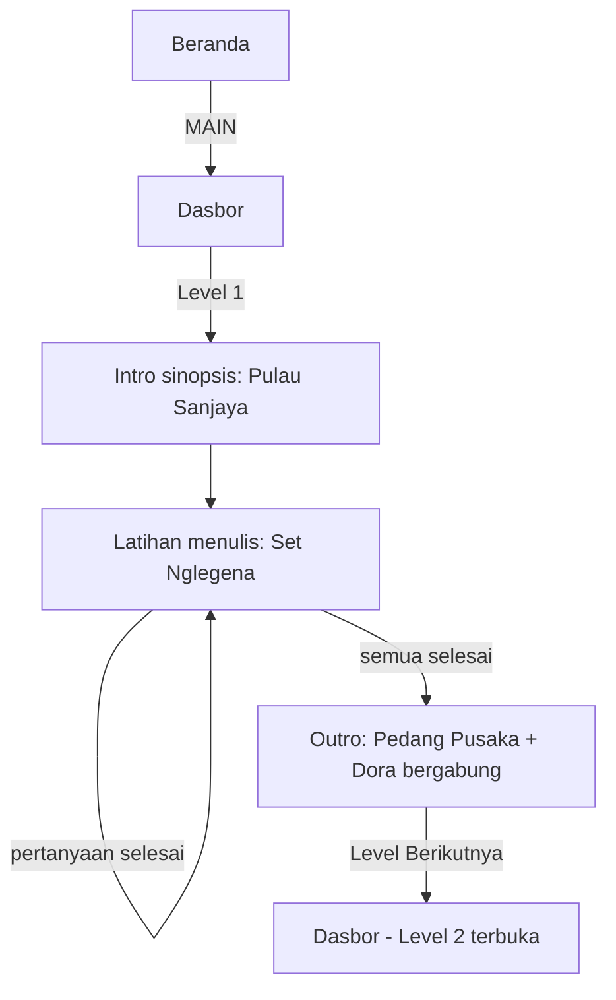
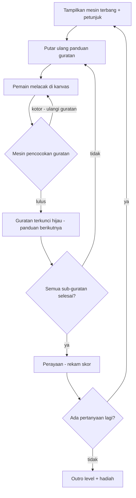

# Petualangan Ajisaka — Aplikasi Pembelajaran Menulis Aksara Jawa

**Dokumen Desain & Pengembangan**

| | |
|---|---|
| **Versi** | 0.1 (draf) |
| **Tanggal** | 2026-08-12 |
| **Status** | Dokumen desain — prabangun |
| **Target rilis** | Installable Progressive Web App (PWA) |
| **Materi sumber** | `projek Isif.pdf` — *Naskah Lengkap Aplikasi Petualangan Ajisaka* |

---

## 1. Gambaran Umum

**Petualangan Ajisaka** adalah aplikasi pembelajaran berbasis gamifikasi yang mengajarkan anak-anak untuk
membaca dan menulis **Aksara Jawa** melalui petualangan yang didorong oleh cerita. Pemain mengikuti pahlawan legendaris **Ajisaka** melintasi tiga pulau,
membuka pusaka dan mengalahkan musuh dengan menyelesaikan tantangan latihan menulis di layar.

Aplikasi ini berjalan sepenuhnya di dalam browser dan dikemas sebagai aplikasi yang dapat diinstal,
**PWA dengan kemampuan luring (offline-capable)** sehingga siswa di tablet berspesifikasi rendah dan Chromebook sekolah dapat
bermain tanpa koneksi internet.

### 1.1 Apa produk ini

- Permainan *latihan guratan (stroke-practice)*: pemain benar-benar menulis Aksara Jawa dengan jari
  atau stylus di atas kanvas, dipandu oleh panduan panah animasi (urutan guratan + arah).
- *Petualangan naratif*: misi menulis dibingkai sebagai peristiwa cerita (membuka segel pedang, menjawab tes tetua desa, bertarung dengan utusan raksasa).
- *Sistem progresi*: tiga level (Pemula → Mahir → Master), hadiah
  (Pedang Pusaka, Perisai Sakti), pengikut yang bergabung dengan kelompok (Dora, penduduk desa
  setempat), dan ujian akhir + penobatan raja.

---

## 2. Tujuan & Bukan Tujuan

### 2.1 Tujuan

| # | Tujuan |
|---|------|
| G1 | Mengajarkan **urutan dan arah guratan** yang benar untuk dasar-dasar Aksara Jawa (Nglegena), Sandangan, dan Pasangan. |
| G2 | Menjaga motivasi pelajar melalui narasi, hadiah, dan tingkat kesulitan yang meningkat. |
| G3 | Bekerja secara **luring (offline)** dan dapat **diinstal** di tablet Android, iPad, dan browser desktop (PWA). |
| G4 | Memberikan umpan balik langsung yang ramah pada setiap guratan (benar/salah, secara langsung). |
| G5 | Melacak kemajuan secara lokal per perangkat (tidak diperlukan akun untuk MVP). |
| G6 | Menyediakan kumpulan data yang lengkap dan dapat digunakan kembali mengenai guratan Aksara Jawa dan pemetaan Unicode untuk fitur masa depan (transliterasi, kuis). |

### 2.2 Bukan Tujuan (MVP)

- ✗ Akun server, sinkronisasi awan (cloud), atau papan peringkat (pekerjaan masa depan).
- ✗ Pengenalan tulisan tangan bebas di luar kumpulan soal yang diajarkan (tidak ada input teks sembarang).
- ✗ Instruksi audio / sintesis ucapan (masa depan; hanya teks di layar).
- ✗ Antarmuka pengguna (UI) multibahasa di luar bahasa Indonesia + bahasa Inggris minimal (masa depan).
- ✗ Toko aplikasi asli (PWA saja untuk saat ini; pembungkus TWA/APK dipertimbangkan nanti).

---

## 3. Pengguna Target & Persona

| Persona | Profil | Kebutuhan |
|---|---|---|
| **Adi (9 tahun)** | Utama: siswa SD yang belajar Aksara Jawa di kelas | Menyenangkan, latihan terpandu, umpan balik langsung, terasa seperti permainan |
| **Bu Sari (32 tahun)** | Guru | Latihan yang dapat ditugaskan, peta level yang jelas, tanpa instalasi di tablet kelas |
| **Pak Damar (40 tahun)** | Orang tua yang membantu di rumah | Instalasi sederhana, luring, tanpa akun, antarmuka pengguna aman untuk anak |

**Konsekuensi desain:** target sentuh besar (≥ 48px), tombol padat kontras tinggi,
teks bahasa Indonesia yang dapat dibaca, pengetikan minimal, tanpa iklan, tanpa pelacakan.

---

## 4. Spesifikasi Narasi & Konten (dari PDF sumber)

### 4.1 Alur cerita tingkat tinggi

```
Petualangan Ajisaka
  ├─ Prolog ─ Mengenal Asal-usul Aksara Jawa (edukasi)
  ├─ Level 1 ─ Pemula   · Pulau Sanjaya    → Pedang Pusaka    (+ Dora bergabung)
  ├─ Level 2 ─ Mahir    · Pulau Adi Jaya   → Perisai Sakti    (+ warga lokal bergabung)
  └─ Level 3 ─ Master   · Kerajaan Nusantara (2 fase) → Raksasa Hijau dikalahkan → dinobatkan sebagai Raja
```

### 4.2 Rincian layar / menu

| # | Layar | Konten | Mekanik penulisan |
|---|--------|---------|------------------|
| 0 | **Halaman Awal (Splash/Home)** | Judul media + tombol **MAIN** besar | — |
| 1 | **Dasbor (Menu Utama)** | 5 menu navigasi: Prolog, Level 1, Level 2, Level 3, *Kembali ke Rumah* | — |
| 2 | **Prolog** | Halaman edukasi: sejarah & asal-usul Aksara Jawa | — |
| 3 | **Level 1 — Pemula** (Pulau Sanjaya) | Sinopsis: buka segel + ambil pedang. **Narasi sinopsis tidak diekstrak utuh dari PDF** → pertanyaan terbuka §20 | Tulis **Aksara Dasar (Nglegena)** dengan **panduan guratan panah** |
| 4 | **Akhir Level 1** | Hadiah: **Pedang Pusaka**; bertemu **Dora** yang bergabung dalam kelompok | — |
| 5 | **Level 2 — Mahir** (Pulau Adi Jaya) | Sinopsis: berlayar bersama Dora, menemukan **Perisai Sakti**, seorang penduduk desa memberikan ujian | **11 soal** (per narasi) penulisan Sandangan |
| 6 | **Akhir Level 2** | Hadiah: **Perisai Sakti**; penduduk desa bergabung dalam kelompok; *Level Berikutnya* | — |
| 7 | **Level 3 — Master, Fase 1** (Penghadangan Dua Utusan) | Dua utusan Raksasa Hijau menghadang kapal di laut; kalahkan mereka dengan menulis | **20 soal Aksara Pasangan** (konsonan bertumpuk: huruf utama + pasangan terlampir di bawah/samping), panduan guratan penuh |
| 8 | **Level 3 — Master, Fase 2** (Penyegelan Raksasa Hijau) | Menyusup ke Kerajaan Nusantara; bebaskan dari Raksasa Hijau | **3 menu latihan × 5 soal = 15 soal**: (1) kalimat dgn Aksara Dasar, (2) kalimat dgn Sandangan, (3) kalimat dgn Pasangan |
| 9 | **Akhir Cerita** | Akhir yang bahagia: Raksasa Hijau disegel; pemain dinobatkan sebagai **Raja Kerajaan Nusantara** | — |

### 4.3 Angka yang dikunci dari narasi

| Item | Jumlah | Sumber |
|---|---|---|
| Soal penulisan Level 2 | **11** | "ke-11 soal" |
| Soal Level 3 Fase 1 | **20** (pasangan) | narasi |
| Soal Level 3 Fase 2 | **15** (3 × 5) | narasi |
| Jumlah soal Level 1 | *tidak ditentukan* | **pertanyaan terbuka §20** |

### 4.4 Kesenjangan konten yang perlu dikonfirmasi (dari anomali PDF)

1. Teks sinopsis Level 1 untuk Pulau Sanjaya (ketukan cerita "membuka segel" ada,
   tetapi paragraf cerita lengkap kosong dalam ekstraksi).
2. Apakah Level 1 *mensyaratkan* Nglegena saja, atau termasuk sub-mode tutorial.
3. Konvensi penamaan hadiah + gaya visual (sumber aset permainan atau SVG dalam aplikasi?).

---

## 5. Persyaratan Fungsional

### FR-1 · Beranda & Navigasi
- **FR-1.1** Layar beranda menampilkan judul media dan tombol utama **MAIN**.
- **FR-1.2** MAIN membuka dasbor; sistem kembali atau "Kembali ke Rumah" kembali ke beranda.
- **FR-1.3** Dasbor selalu mencantumkan `Prolog`, `Level 1`, `Level 2`, `Level 3`, `Kembali ke Rumah`.
- **FR-1.4** Level yang terkunci dikunci secara visual dan menampilkan petunjuk "selesaikan level sebelumnya" (jangan memblokir navigasi secara paksa; izinkan membaca Prolog kapan saja).

### FR-2 · Cerita / Prolog
- **FR-2.1** Prolog menyajikan cerita asal-usul Aksara Jawa sebagai adegan bergambar.
- **FR-2.2** Mendukung ketuk-untuk-melanjutkan (seperti dek salindia); dapat dilewati dengan konfirmasi.

### FR-3 · Latihan Menulis (alur permainan inti)
- **FR-3.1** Setiap pertanyaan menampilkan mesin terbang (glyph) referensi (disajikan dengan font bahasa Jawa) + romanisasinya + petunjuk bahasa Indonesia.
- **FR-3.2** Area kanvas menangkap guratan tangan bebas (satu sentuhan/stylus; multi-sentuh dinonaktifkan).
- **FR-3.3** **Panduan guratan** animasi: ujung panah bernomor yang menunjukkan arah dan urutan, dapat diputar ulang sesuai permintaan.
- **FR-3.4** Umpan balik langsung: indikator kecocokan guratan (misalnya, hijau = bagus, kuning = dapat diterima, merah = arah/urutan salah).
- **FR-3.5** Di antara guratan, panduan untuk sub-guratan berikutnya disorot; guratan yang selesai tetap terlihat.
- **FR-3.6** Kontrol **Undo / Bersihkan** (besar, aman untuk anak).
- **FR-3.7** Setelah pertanyaan selesai: umpan balik mikro perayaan, lalu maju otomatis atau "Lanjut".
- **FR-3.8** Jawaban yang salah tetapi telah dicoba dapat diulang (tidak ada kunci status gagal pada MVP).

### FR-4 · Alur Level & Hadiah
- **FR-4.1** Layar pengantar level = ketukan cerita (sinopsis) → sesi latihan → ketukan outro.
- **FR-4.2** Saat selesai tampilkan item hadiah + pembaruan cerita (misalnya, "Dora bergabung!").
- **FR-4.3** Tombol "Level Berikutnya" membuka level berikutnya.
- **FR-4.4** Level 3 memiliki dua fase dengan interstisial transisi fase.

### FR-5 · Persistensi
- **FR-5.1** Pertahankan: level yang diselesaikan, skor terbaik per pertanyaan, hadiah yang dikumpulkan, pengaturan.
- **FR-5.2** Dapat dilanjutkan: menutup di pertengahan level akan kembali ke dasbor dengan kemajuan yang utuh; lanjutkan dimulai dari pertanyaan pertama yang belum terjawab.
- **FR-5.3** Penyimpanan: lokal-pertama (IndexedDB melalui fasad `localStorage` untuk status MVP; data kanvas sesaat).

### FR-6 · PWA
- **FR-6.1** Dapat diinstal (manifes + ikon + pekerja layanan (service worker) yang valid).
- **FR-6.2** Resmi **luring-pertama (offline-first)**: aplikasi cangkang (app shell) penuh + pra-tembolok aset (font, data, ikon); tidak diperlukan jaringan untuk bermain.
- **FR-6.3** Pembaruan: pekerja layanan berversi dengan perintah untuk menyegarkan saat rilis baru ditembolok.

---

## 6. Arsitektur Informasi & Navigasi

```
Beranda (Halaman Awal)
  │  [MAIN]
  ▼
Dasbor ───────────────────► (5 menu)
  ├── Prolog ─────────────► Salindia cerita ──► kembali
  ├── Level 1 (Pemula) ───► [Intro sinopsis] ─► Latihan L1 ─► [Hadiah: Pedang] ─► Level Berikutnya
  ├── Level 2 (Mahir) ────► [Intro sinopsis] ─► Latihan L2 (11) ─► [Hadiah: Perisai] ─► Level Berikutnya
  ├── Level 3 (Master) ───► Fase 1: Latihan Pasangan (20) ─► Fase 2: Lat.1 (5) Lat.2 (5) Lat.3 (5) ─► Akhir Cerita
  └── Kembali ke Rumah ───► Beranda
```

### 6.1 Aturan navigasi
- Fitur global, **kembali** terus-menerus pada setiap layar non-dasbor (kembali dari sistem + tombol yang terlihat).
- Dasbor adalah hub pusat; semua layar level kembali ke dasbor.
- *Level Berikutnya* adalah satu-satunya gerbang maju; ini muncul hanya setelah suatu level selesai.

---

## 7. Alur Pengguna

### 7.1 Bermain untuk pertama kalinya melalui Level 1


### 7.2 Lingkaran penulisan pertanyaan tunggal


---

## 8. Inventaris Layar (peta rute)

| Rute | Layar | UI Utama |
|---|---|---|
| `/` | Beranda | Judul, MAIN |
| `/menu` | Dasbor | 5 kartu level |
| `/prolog` | Cerita prolog | Salindia, lewati |
| `/level/1` | Alur L1 | Intro / latihan / outro |
| `/level/2` | Alur L2 | Intro / latihan(11) / outro |
| `/level/3` | Alur L3 | Latihan Fase1(20) → Fase2 3×latihan(15) → akhir cerita |
| `/ending` | Akhir bahagia | Upacara penobatan |

(Rute hanya sisi klien; PWA menyajikan aplikasi cangkang untuk setiap jalur → gunakan perute hash (hash router) atau perutean pekerja layanan (SW) kembali ke `/`.)

---

## 9. Sistem Desain

### 9.1 Bahasa desain
Tiga lapisan (per pagar pembatas produk):

1. **Material You** — model interaksi: permukaan sentuh adaptif, permukaan tonal,
   elevasi dinamis, tombol berbantalan besar, sudut membulat.
2. **Minimalisme** — disiplin tata letak: ruang putih yang luas, hierarki yang jelas,
   satu tindakan utama per layar, mengurangi kebisingan visual sehingga anak berusia 9 tahun tidak kewalahan.
3. **Glassmorfisme** — hanya sebagai *aksen* pada layar cerita/interstisial (panel buram di atas latar belakang bergambar); bukan pada permukaan permainan (kanvas sketsa harus tetap bebas silau untuk menulis).

Genre: **menyenangkan** (post-Linear soft school: konsumen, kasual, anak-anak). Hangat, palet dominan pastel dengan aksen "keraton" yang dalam. Ilustrasi adalah mereknya: siluet seni garis Ajisaka yang digambar tangan (SVG sederhana), bukan foto.

### 9.2 Palet (Tema Keraton)

Berasal dari sistem token **Karnaval (Carnival)** yang menyenangkan, diwarnai ulang ke arah
warna warisan Jawa (keraton nila/merah-emas + netral batik), yang mengutamakan pastel.

| Token | Nilai (OKLCH) | Penggunaan |
|---|---|---|
| `--color-paper` | `oklch(97% 0.012 78)` | Latar belakang aplikasi (krem batik) |
| `--color-paper-2` | `oklch(92% 0.03 78)` | Permukaan kartu |
| `--color-paper-3` | `oklch(84% 0.05 55)` | Melayang/permukaan interaktif |
| `--color-text` | `oklch(34% 0.04 262)` | Teks utama (hitam-nila pekat) |
| `--color-text-2` | `oklch(52% 0.03 262)` | Teks diredam |
| `--color-accent` | `oklch(58% 0.14 25)` | Tindakan utama (merah keraton / terakota) |
| `--color-accent-2` | `oklch(70% 0.13 80)` | Sukses / emas (hadiah pedang & perisai) |
| `--color-warn` | `oklch(66% 0.14 60)` | Peringatan / ulangi guratan |
| `--color-error` | `oklch(52% 0.16 27)` | Kesalahan / arah guratan salah |
| `--color-border` | `oklch(86% 0.025 78)` | Pembatas |
| `--color-focus` | `oklch(60% 0.16 262)` | Cincin `:focus-visible` (nila) |
| `--color-glass` | `oklch(100% 0 0 / 0.55)` | Isi hamparan buram |

Mode gelap: diturunkan secara otomatis dengan membalikkan pita kertas (simpan untuk kelas)
melalui `@media (prefers-color-scheme: dark)` + `[data-theme=dark]`.

### 9.3 Tipografi

| Peran | Token | Tumpukan (Stack) |
|---|---|---|
| Tampilan / judul permainan | `--font-display` | `'Fredoka One', 'Baloo 2', system-ui, sans-serif` (membulat, ramah anak) |
| Tubuh / salinan | `--font-body` | `'Nunito', system-ui, sans-serif` |
| Kode / label data mesin terbang | `--font-mono` | `'JetBrains Mono', monospace` |

**Skala** (dari sistem token): tampilan `clamp(2.5rem,6vw,4.5rem)`, tampilan-s
`clamp(2rem,4vw,3rem)`, 2xl `1.75rem`, xl `1.25rem`, lg `1.125rem`, dasar `1rem`,
sm `0.875rem`, xs `0.75rem`.

**Aturan:** judul selalu roman (tidak ada judul miring); huruf miring hanya digunakan di dalam salinan teks untuk penekanan. Salinan bahasa Indonesia secara menyeluruh; pertahankan kalimat-kalimat pendek (≤ 12 kata).

**Font mesin terbang (glyph) bahasa Jawa:** dihosting mandiri (self-hosted) **Noto Sans Javanese** (Blok Unicode U+A980–U+A9DF) untuk merender mesin terbang referensi. Tumpukan font cadangan pada kanvas:
`'Noto Sans Javanese', sans-serif`. (Pemuatan mesin terbang paling awal dipra-tembolok oleh SW.)

**Perbedaan Gaya Regional (Gagrak Surakarta vs Yogyakarta):**
Aplikasi ini secara ketat menggunakan **Noto Sans Javanese** murni, yang didasarkan pada konvensi gaya **Gagrak Surakarta**. Klien dan pengguna mungkin memperhatikan bahwa karakter tertentu—khususnya **ra (ꦫ)**, **da (ꦢ)**, dan **dha (ꦝ)**—memiliki bentuk yang sedikit berbeda dibandingkan dengan buku teks sekolah standar, yang sering kali menggunakan gaya **Gagrak Yogyakarta**.

- **Mengapa ini terjadi (Kendala Teknis):** Aksara Jawa adalah naskah yang sangat kompleks. Ketika seorang pengguna mengetik huruf dasar dan menambahkan tanda vokal (seperti *suku* atau *wulu*), font tersebut tidak hanya menempatkannya berdampingan. Sebaliknya, mesin font menggunakan aturan bawaan yang kompleks (disebut GSUB atau Substitusi Glyph) untuk secara ajaib menukar kedua bagian menjadi bentuk gabungan baru yang digambar dengan indah (ligatur).
- **Keputusan Desain:** Jika kami mencoba menukar dengan teliti bentuk `ra`, `da`, atau `dha` dasar saja agar terlihat seperti versi buku teks, aturan kombinasi kompleks tersebut akan langsung rusak. Ketika pengguna mencoba mengetik, huruf-hurufnya akan terputus, tumpang tindih secara tidak benar, atau tiba-tiba kembali ke bentuk lama.
- **Alasan Bisnis:** Membangun ulang font Aksara Jawa khusus dengan ribuan aturan ligatur GSUB baru untuk gaya Yogyakarta adalah upaya rekayasa tipografi yang sangat besar, sangat terspesialisasi, yang berada di luar cakupan proyek ini. Oleh karena itu, kami dengan sengaja memilih untuk menggunakan font Noto Sans yang kuat dan berstandar industri. Hal ini menjamin bahwa pengetikan, rendering, dan alur permainan 100% bebas dari kesalahan dan fungsional, dengan pertukaran (trade-off) yang dapat diterima dalam penggunaan gaya regional Surakarta.

### 9.4 Spasi, radius, elevasi

- Spasi: skala dasar 4px (xs 4, sm 8, md 12, lg 16, xl 24, 2xl 32, 3xl 48 …).
- Radius: sm 4 / md 8 / lg 16 — gunakan kembali, jangan pernah menciptakan.
- Elevasi: Elevasi tonal Material — kartu = paper-2 pada paper; modal menggunakan
  `box-shadow` dengan kaca buram (hanya interstisial cerita).
- Target sentuh: **minimal 48×48px**, celah interaktif ≥ 8px.

### 9.5 Gerakan (Motion)

- Durasi: cepat 150ms (melayang/mikro), dasar 250ms, lambat 400ms (transisi layar).
- Pelonggaran (Easings): `cubic-bezier(0.16,1,0.3,1)` masuk / `cubic-bezier(0.4,0,0.68,0.06)` keluar.
- Semua animasi masuk/goyangan/penghitung/pemuat melalui cuplikan **anime.js v4**,
  masing-masing dijaga oleh `prefers-reduced-motion`.
- Salindia cerita: transisi pudar menyilang (crossfade) + sedikit skala; umpan balik alur permainan: pegas cepat pada penguncian guratan.
- **Rasa permainan:** ledakan partikel seperti konfeti pada penyelesaian pertanyaan dan di hadiah level (Kanvas Web, pertahankan di bawah 60 partikel).

### 9.6 Ikonografi

Font Awesome (gratis) menurut standar; alternatif yang dipertimbangkan: Material Symbols,
Lucide. Gunakan ejaan/visual yang dikenali anak-anak (perisai, pedang, rumah, panah,
pertanyaan, bintang). Semua tombol ikon membawa `aria-label`.

### 9.7 Komponen (disiplin 8 status)

| Komponen | Status ke gaya |
|---|---|
| `Button` (primer/hantu/bahaya) | default, hover, focus-visible, active, disabled, loading, error, success |
| `LevelCard` | default, hover, focus, active, locked, completed, current, disabled |
| `PracticeCanvas` | idle, guiding, drawing, stroke-locked, feedback(ok/warn/error), cleared |
| `IconButton` (kembali/undo/clear/replay) | semua 8 status |
| `Modal` (selamat, reset, perbarui) | buka/tutup animasi + jebakan fokus |

---

## 10. Model & Data Domain

### 10.1 Dataset Aksara (`src/data/aksara.ts`)

```ts
type AksaraType = 'nglegena' | 'sandangan' | 'pasangan';

interface AksaraGlyph {
  id: string;                    // "ha", "na", "ca" ...
  type: AksaraType;
  label: string;                 // romanisasi
  hintID: string;                // kunci terjemahan petunjuk bahasa Indonesia
  unicode: string;               // mis. "\uA98F" (ha)
  unicodePasangan?: string;      // titik kode mesin terbang pasangan jika berlaku
  /** Guratan vektor yang dinormalisasi, dalam satuan kotak tulis (0..1). */
  strokes: Stroke[];             // diurutkan! = urutan-guratan/isomorfisme
  sound?: string;                // fonem untuk TTS di masa depan
}

interface Stroke {
  points: Array<{ x: number; y: number }>;  // polyline, koordinat kotak 0..1
  tolerance: number;                         // kelonggaran per guratan (standar 0.12)
}
```

### 10.2 Konfigurasi level

```ts
interface LevelConfig {
  id: number;
  title: string;          // "Level 1 · Pemula · Pulau Sanjaya"
  questions: Question[];
  reward: { id: string; name: string };   // "Pedang Pusaka"
  story: { intro: string; outro: string };
}

interface Question {
  id: string;
  glyphId: string;        // → AksaraGlyph
  prompt: string;         // "Tulis aksara: HA (dasar)"
  sentence?: string;      // kalimat bahasa Jawa lengkap untuk soal Fase-2
}
```

### 10.3 Konten benih (diusulkan; volume = pertanyaan terbuka)

| Set | Tipe | Jumlah |
|---|---|---|
| Nglegena (dasar) | 20 + varian opsional | digunakan di L1, L3-Fase2 menu 1 |
| Sandangan | 8 inti (a→i,u,e,o, taling/tarung, pepet, cecak, dll.) | L2 (11 soal termasuk kombo), L3-F2 menu 2 |
| Pasangan | pasangan huruf utama + mesin terbang pasangan | L3-F1 (20 soal), L3-F2 menu 3 |

Jumlah akhir per level dikonfirmasi di §4.3; isi pertanyaan (mesin terbang mana) adalah sebuah **keputusan kurikulum** — usulkan standar §20.

---

## 11. Desain Mesin Guratan (tantangan inti)

### 11.1 Pengambilan gambar (Capture)
- `<canvas>` area pandang (viewport) penuh dari kotak tulis; **Pointer Events** (`pointerdown/move/up`) disatukan untuk sentuhan + stylus + mouse; `touch-action: none` untuk menghentikan pengguliran.
- Titik-titik diturunkan sampelnya (spasi ≥ 10px) dan dinormalisasi ke dalam kotak tulis 0..1.
- HiDPI: ukuran kanvas ke `devicePixelRatio`, kotak CSS ditetapkan.

### 11.2 Rendering panduan guratan
- Gambar setiap referensi polyline `Stroke` sebagai panduan target samar.
- Kemajuan animasi di sepanjang jalur = pelacak "kepala panah" klasik (anime.js atau `requestAnimationFrame`), dapat diputar ulang melalui tombol **Putar Ulang (Replay)**.
- Panduan sub-guratan berikutnya yang diharapkan disorot; guratan yang selesai digambar padat + tanda centang.

### 11.3 Pencocokan online (luring, deterministik, cepat)
Pendekatan untuk mempertahankan bobot 0 dan berjalan di perangkat:
1. **Normalisasikan** masukan guratan (sampel ulang ke N=32 titik, skalakan ke 0..1, terjemahkan
   ke tengah, jaga aspek proporsional).
2. **Tanda arah:** keranjang sudut per segmen (misalnya, 8 keranjang).
3. **Cakupan Raster** Jarak (Pencocok Garis Besar Geometris) ke guratan rujukan yang dinormalisasi (proksi: polylines padat yang disampel ulang menghitung perpotongan terhadap area perimeter yang diharapkan).
4. **Urutan = kebenaran:** guratan harus diselesaikan dalam urutan rujukan; pembalikan
   memicu umpan balik "arah salah" meskipun bentuknya cocok.
5. Skor → `lulus / peringatan / ulangi` melalui toleransi per-guratan.

Peningkatan kemampuan opsional di masa depan: model **ONNX/TFLite** mungil (`12 class output`,
< 500 KB) dilatih pada augmentasi dari 32 mesin terbang referensi, berjalan melalui
`@xenova/transformers` atau TensorFlow.js polos — ditukar di balik antarmuka `StrokeMatcher`
yang sama. **Bukan dalam MVP.**

### 11.4 Pemetaan umpan balik
| Sinyal | Arti | Warna |
|---|---|---|
| lulus (pass) | guratan sesuai bentuk+urutan | hijau (`accent-2`) |
| peringatan (warn) | bentuk oke, sedikit bergeser | emas (`warn`) |
| ulangi (retry) | arah / urutan salah | merah (`error`) |

---

## 12. PWA & Arsitektur

### 12.1 Tumpukan (Stack) yang direkomendasikan

| Perhatian | Pilihan |
|---|---|
| Bahasa | **TypeScript (strict)** |
| Pembuatan (Build) | **Vite** |
| Kerangka UI | **React 18** (atau Svelte jika runtime yang lebih ringan lebih disukai — lihat §20) |
| Gaya (Styling) | **Tailwind CSS v4** dengan token kustom-properti CSS (OKLCH) |
| Keadaan (State) | Zustand dengan perangkat tengah (middleware) `persist` (localStorage) |
| Perutean (Routing) | `react-router` + **perutean hash** (ramah luring, tidak diperlukan penulisan ulang server) |
| PWA | `vite-plugin-pwa` (Workbox): manifes + pra-tembolok SW + cadangan luring |
| Kanvas/permainan | Native Canvas 2D + anime.js v4 (gerakan) |
| Ikon | Font Awesome (gratis) |
| Data lokal | Dataset JSON/TS (§10) + `localStorage` untuk kemajuan |
| Pengujian | Vitest + Testing Library; Playwright (E2E, simulasi luring) |
| Lint/format | ESLint (flat) + Prettier (cocok dengan `.pre-commit-config.yaml` yang ada) |
| Ikon/aset aplikasi | inline SVG (kirik) agar pra-tembolok SW tetap kecil |

### 12.2 Arsitektur berlapis

```
┌───────────────────────────────────────────────┐
│ Lapisan UI      Komponen React, rute,         │
│                 layar, salindia cerita        │
├───────────────────────────────────────────────┤
│ Aplikasi        LevelFSM, Sesi pertanyaan,    │
│                 toko kemajuan, logika hadiah  │
├───────────────────────────────────────────────┤
│ Domain          dataset aksara.ts, Antarmuka  │
│                 pencocok Stroke, penilaian    │
├───────────────────────────────────────────────┤
│ Infrastruktur   CanvasEngine (tangkapan+paduan),│
│                 Cakupan Raster, Zustand persis, │
│                 PWA/SW, audio (bunyi gamelan) │
└───────────────────────────────────────────────┘
```

### 12.3 Model Status (Zustand `useProgress`)

```ts
interface ProgressState {
  completedLevels: number[];        // [1,2,3]
  rewards: string[];                // ['pedang','perisai']
  bestByQuestion: Record<string, number>; // questionId -> skor persen
  currentLevel?: number;            // titik lanjutan
  unfinished: string[];             // ID pertanyaan yang belum terselesaikan di level saat ini
  settings: { sound: boolean; dark: boolean };
}
```

### 12.4 Strategi Luring & SW

- **Pra-tembolok (build-time, hash):** shell HTML, potongan JS/CSS, font Jawa (woff2),
  dataset, ikon SVG inline — seluruh aplikasi berfungsi tanpa jaringan.
- **Tembolok Runtime:** tidak diperlukan untuk MVP (semua lokal); pra-tembolok mencakup semuanya.
- **Alur pembaruan:** `registerSW` + spanduk dorongan untuk menyegarkan saat `updatedready`.
- **Tanpa backend:** nol panggilan API; CSP diperketat; tanpa analitik.
- Manifes: nama "Petualangan Ajisaka", `display: standalone`, `orientation: portrait` (dioptimalkan
  untuk penulisan), warna tema = `--color-paper`, set ikon termasuk maskable `512px`.

---

## 13. Struktur Proyek yang Diusulkan

```
javanese_learning_app/
├─ public/
│  ├─ icons/            (192, 512, maskable)
│  └─ fonts/            (NotoSansJavanese woff2)
├─ src/
│  ├─ data/             aksara.ts, levels.ts, sentences.ts
│  ├─ engine/           capture.ts, normalize.ts, dtw.ts, matcher.ts
│  ├─ state/            progress.ts
│  ├─ ui/               components/, screens/
│  ├─ hooks/            useCanvas.ts, useStrokeSession.ts
│  ├─ styles/           tokens.css, base.css
│  ├─ App.tsx
│  └─ main.tsx
├─ vite.config.ts        (+ vite-plugin-pwa)
├─ tsconfig.json
├─ index.html
└─ DESIGN_AND_DEV.md
```

---

## 14. Strategi Pengujian

- **Unit:** `dtw.ts` (kasus cocok/gagal), `normalize.ts`, transisi toko kemajuan,
  penilaian pertanyaan, gerbang pembukaan level.
- **Komponen:** status layar latihan (kosong/panduan/peringatan/kesalahan/sukses), label tombol kanvas,
  jebakan fokus modal.
- **E2E (Playwright):** alur Beranda→L1 selesai→L2 terbuka; muat ulang di pertengahan level dilanjutkan;
  **simulasi luring** memverifikasi pemutaran penuh tanpa jaringan.
- **Matriks perangkat manual:** iPad, tablet Android (Chrome), desktop (tampilan seluler potret).
- **A11y:** pemindaian axe-core di CI.
- Pra-komit (hook yang ada) tetap berjalan; tambahkan `eslint`/`prettier`/`tsc --noEmit` di sana.

---

## 15. Anggaran Kinerja (luring-pertama)

| Metrik | Anggaran |
|---|---|
| Beban pertama (hit tembolok luring) | ≤ 1.5 MB JS + aset; font ≤ 600 KB woff2 |
| TTI di tablet kelas menengah | ≤ 3 dtk |
| Total pra-tembolok SW | ≤ 4–5 MB |
| Bingkai kanvas selama penelusuran | 60 fps |
| Latensi pengenalan | < 50 md (Cakupan Raster pada resampel langkah 0.02) |

---

## 16. Aksesibilitas (WCAG 2.1 AA)

- Warna tidak pernah menjadi satu-satunya sinyal: lulus/peringatan/kesalahan membawa ikon + teks.
- Cincin fokus-terlihat `--color-focus`, `outline-offset: 2px`; tautan-lewati; tag penanda.
- Dioperasikan dengan papan ketik (panah pada salindia cerita; Enter/Spasi pada kontrol); kanvas memiliki
  deskripsi cadangan yang dapat diakses untuk setiap pertanyaan.
- `prefers-reduced-motion` menonaktifkan animasi panduan guratan, partikel, efek salindia.
- Kontras: teks tubuh ≥ 4.5:1; UI ≥ 3:1 (verifikasi dengan pemeriksa WebAIM pada heksa akhir).
- Semua salinan teks bahasa Indonesia pendek, polos; teks alternatif pada adegan bergambar.

---

## 17. Keamanan

- Tidak ada masukan pengguna yang disajikan sebagai HTML (semua konten dari dataset yang digabungkan).
- CSP: `default-src 'self'; script-src 'self'; font-src 'self'; img-src 'self' data:;`
  (tidak ada CDN eksternal saat runtime — semuanya dipra-tembolok).
- Tidak ada rahasia/kunci dalam klien (tidak dibutuhkan); tidak ada lalu lintas jaringan yang bocor.
- Masukan kanvas divalidasi/diabaikan di luar kotak tulis; multi-sentuh menekan guratan nyasar.

---

## 18. Peta Jalan / Tonggak Pencapaian (Milestones)

| Tonggak Pencapaian | Cakupan |
|---|---|
| **M0 — Benih & cangkang** | Aplikasi Vite+TS, token, rute, dasbor, manifes/SW, layar latihan kosong |
| **M1 — Mesin guratan** | Tangkapan kanvas, animasi panduan, Pencocok Cakupan Raster, pemetaan umpan balik |
| **M2 — Konten** | Dataset penuh (Nglegena 20+ / Sandangan 8+ / pasangan Pasangan), konfigurasi level, salinan cerita dalam bahasa Indonesia |
| **M3 — Alur permainan** | Level FSM, hadiah, Dora/penduduk desa bergabung, akhir, ketekunan kemajuan |
| **M4 — Penyelesaian QA** | Partikel, suara, E2E luring, pemindaian a11y, matriks perangkat, spanduk pembaruan |

---

## 19. Pekerjaan Masa Depan (setelah MVP)

- Input Transliterasi / teks-ke-Aksara; pengucapan (gamelan + TTS).
- Sinkronisasi Cloud & analitik guru (ganti nama: Laporan "Guru").
- APK Android via TWA; set mesin terbang yang lebih luas (Angka, Murda, Swara).
- Peningkatan pengklasifikasi guratan ML di balik antarmuka pencocok.

---

## 20. Keputusan Akhir (Telah Diselesaikan)

| # | Pertanyaan | Keputusan Final |
|---|---|---|
| 1 | Jumlah pertanyaan Level 1 | ✅ **20 Soal Nglegena Lengkap**. Seluruh 20 aksara dasar dimasukkan agar pemain berlatih semua bentuk dasar sebelum lanjut ke sandangan. |
| 2 | Isi pertanyaan pasti per set | ✅ **Dataset Penuh**. L1 (20 Nglegena), L2 (8 Sandangan), L3 Fase 1 (20 Pasangan), L3 Fase 2 (15 Kuis Ketik). |
| 3 | Paragraf sinopsis lengkap Level-1 | ✅ **Selesai**. Cerita telah ditulis lengkap dan ditranslasikan secara i18n (Indonesia, Inggris, Krama Inggil) di dalam komponen. |
| 4 | Sumber hadiah/seni aset | ✅ **Seni CSS/Canvas Generatif**. Menggunakan bentuk-bentuk estetis murni kode (Pedang, Perisai, Mahkota) untuk menghemat ukuran bundel. |
| 5 | Kerangka UI | ✅ **React 18 + Vite** dengan status dari Zustand dan gaya via Tailwind CSS v4. |
| 6 | PWA Potret saja OK? | ✅ **Ya**. Orientasi potret dikunci via manifes PWA (`orientation: portrait`), paling optimal untuk kanvas menulis. |

---

## 21. Referensi

- Narasi sumber: `projek Isif.pdf` (Naskah Lengkap Aplikasi Petualangan Ajisaka).
- Font: Noto Sans Javanese (OFL) — di-hosting sendiri.
- Standar: WCAG 2.1 AA; kriteria pemasangan PWA (Chrome/Android, iOS 16+).
- Dasar sistem desain: Set token *Karnaval* yang menyenangkan (arsitektur kertas/aksen OKLCH)
  diubah warnanya menjadi palet keraton dalam §9.2.

---

*Akhir dokumen. Langkah selanjutnya: konfirmasi keputusan §20, lalu siapkan M0.*